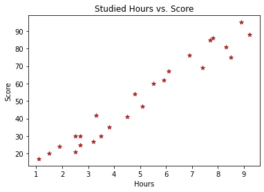
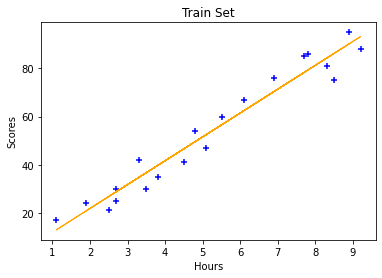
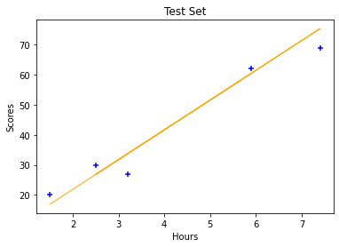

# **The Sparks Foundation**

### Author: Leah Nguyen
Copyright © 2021 Leah Nguyen

## **Task 1 - Prediction Using Supervised ML**
In this exercise, we will predict the percentage of an student based on the no. of study hours by applying the concepts of a simple linear regression as it involves just 2 variables.

The steps are:
1.   Import libraries
2.   Load Dataset
3.   Data Exploration
4.   Data Visualization
5.   Data Preparation
6.   Train Data
7.   Test Data
8.   Model Evaluation
9.   Predicting The Score (Bonus)

### Import Libraries


```python
# Importing all libraries required in this notebook
import pandas as pd
import numpy as np  
import matplotlib.pyplot as plt
import seaborn as sns
%matplotlib inline
from sklearn.model_selection import train_test_split
from sklearn.linear_model import LinearRegression
from sklearn.metrics import mean_absolute_error
from sklearn import metrics
```

### Load Dataset


```python
# Importing data
url =  "http://bit.ly/w-data"
data = pd.read_csv(url)
print("Data is successfully imported")

# Inspect the first 10 rows of the daataset
data.head(10)
```

    Data is successfully imported
    


<div>
<style scoped>
    .dataframe tbody tr th:only-of-type {
        vertical-align: middle;
    }

    .dataframe tbody tr th {
        vertical-align: top;
    }

    .dataframe thead th {
        text-align: right;
    }
</style>
<table border="1" class="dataframe">
  <thead>
    <tr style="text-align: right;">
      <th></th>
      <th>Hours</th>
      <th>Scores</th>
    </tr>
  </thead>
  <tbody>
    <tr>
      <th>0</th>
      <td>2.5</td>
      <td>21</td>
    </tr>
    <tr>
      <th>1</th>
      <td>5.1</td>
      <td>47</td>
    </tr>
    <tr>
      <th>2</th>
      <td>3.2</td>
      <td>27</td>
    </tr>
    <tr>
      <th>3</th>
      <td>8.5</td>
      <td>75</td>
    </tr>
    <tr>
      <th>4</th>
      <td>3.5</td>
      <td>30</td>
    </tr>
    <tr>
      <th>5</th>
      <td>1.5</td>
      <td>20</td>
    </tr>
    <tr>
      <th>6</th>
      <td>9.2</td>
      <td>88</td>
    </tr>
    <tr>
      <th>7</th>
      <td>5.5</td>
      <td>60</td>
    </tr>
    <tr>
      <th>8</th>
      <td>8.3</td>
      <td>81</td>
    </tr>
    <tr>
      <th>9</th>
      <td>2.7</td>
      <td>25</td>
    </tr>
  </tbody>
</table>
</div>


### Data Exploration


```python
# We can able to see percentiles,mean,std,max,count of the given dataset by using the describe() function.
data.describe()
```


<div>
<style scoped>
    .dataframe tbody tr th:only-of-type {
        vertical-align: middle;
    }

    .dataframe tbody tr th {
        vertical-align: top;
    }

    .dataframe thead th {
        text-align: right;
    }
</style>
<table border="1" class="dataframe">
  <thead>
    <tr style="text-align: right;">
      <th></th>
      <th>Hours</th>
      <th>Scores</th>
    </tr>
  </thead>
  <tbody>
    <tr>
      <th>count</th>
      <td>25.000000</td>
      <td>25.000000</td>
    </tr>
    <tr>
      <th>mean</th>
      <td>5.012000</td>
      <td>51.480000</td>
    </tr>
    <tr>
      <th>std</th>
      <td>2.525094</td>
      <td>25.286887</td>
    </tr>
    <tr>
      <th>min</th>
      <td>1.100000</td>
      <td>17.000000</td>
    </tr>
    <tr>
      <th>25%</th>
      <td>2.700000</td>
      <td>30.000000</td>
    </tr>
    <tr>
      <th>50%</th>
      <td>4.800000</td>
      <td>47.000000</td>
    </tr>
    <tr>
      <th>75%</th>
      <td>7.400000</td>
      <td>75.000000</td>
    </tr>
    <tr>
      <th>max</th>
      <td>9.200000</td>
      <td>95.000000</td>
    </tr>
  </tbody>
</table>
</div>


```python
# Inspect the summary of the dataframe
data.info()
```

    <class 'pandas.core.frame.DataFrame'>
    RangeIndex: 25 entries, 0 to 24
    Data columns (total 2 columns):
     #   Column  Non-Null Count  Dtype  
    ---  ------  --------------  -----  
     0   Hours   25 non-null     float64
     1   Scores  25 non-null     int64  
    dtypes: float64(1), int64(1)
    memory usage: 528.0 bytes
    

### Visualizing Data
Let's plot our data points on 2-D graph to eyeball our dataset and see if we can manually find any relationship between the data.


```python
# Plotting the distribution of scores
plt.scatter(data.Hours,data.Scores,color='brown',marker='*')
plt.title('Studied Hours vs. Score')
plt.xlabel('Hours')  
plt.ylabel('Score')
```


    Text(0, 0.5, 'Score')


    

    


- **Finding:** From the graph above, we can clearly see that there is a positive linear relation between the number of hours studied and percentage of score.

### Preparing Data 
The next step is to divide the data into "attributes" (inputs) and "labels" (outputs).


```python
x=np.array(data.Hours)
y=np.array(data.Scores)
```

Reshaping the numpy array for vertical output.


```python
x=x.reshape(-1,1)
y=y.reshape(-1,1)
```

Now that we have our attributes and labels, the next step is to split this data into training and test sets. We'll do this by using Scikit-Learn's built-in train_test_split() method:


```python
x_train, x_test, y_train, y_test = train_test_split(x, y, test_size=0.2, random_state=0)
```


```python
## We have Splitted Our Data Using 80:20 RULe(PARETO)
print("X train.shape =", x_train.shape)
print("Y train.shape =", y_train.shape)
print("X test.shape  =", x_test.shape)
print("Y test.shape  =", y_test.shape)
```

    X train.shape = (20, 1)
    Y train.shape = (20, 1)
    X test.shape  = (5, 1)
    Y test.shape  = (5, 1)
    

### Train Data

Calling the linear function and reshaping all the data and fitting it to the model.


```python
linreg = LinearRegression()
x_test = x_test.reshape(-1,1)
y_test = y_test.reshape(-1,1)
x_train = x_train.reshape(-1,1)
y_train = y_train.reshape(-1,1)
linreg.fit(x_train,y_train)

print("Training our algorithm is finished")
```

    Training our algorithm is finished
    

Formula of simple linear regression


```python
line1=linreg.coef_ * x_train + linreg.intercept_
```


```python
##plotting on train data
plt.scatter(x_train,y_train,color='blue',marker='+')
plt.plot(x_train,line1,color='orange',linewidth=1)
plt.xlabel("Hours")
plt.ylabel("Scores")
plt.title("Train Set")
plt.show()
```


    

    


### Test Data

Formula of simple linear regression


```python
line2 = linreg.coef_ * x_test + linreg.intercept_
```

Predicting the scores for test data


```python
y_pred=linreg.predict(x_test)
print(y_pred)
```

    [[16.88414476]
     [33.73226078]
     [75.357018  ]
     [26.79480124]
     [60.49103328]]
    


```python
##plotting on test data
plt.scatter(x_test,y_test,color='blue',marker='+')
plt.plot(x_test,line2,color='orange',linewidth=1)
plt.xlabel("Hours")
plt.ylabel("Scores")
plt.title("Test Set")
plt.show()
```


    

    


### Model Evaluation

The final step is to evaluate the performance of algorithm. This step is particularly important to compare how well different algorithms perform on a particular dataset. For simplicity here, we have chosen the mean square error. There are many such metrics.


```python
y_test1 = y_test.flatten()
prediction = y_pred.flatten()
df_compare = pd.DataFrame({ 'Actual':y_test1,'Result':prediction})
df_compare
```


<div>
<style scoped>
    .dataframe tbody tr th:only-of-type {
        vertical-align: middle;
    }

    .dataframe tbody tr th {
        vertical-align: top;
    }

    .dataframe thead th {
        text-align: right;
    }
</style>
<table border="1" class="dataframe">
  <thead>
    <tr style="text-align: right;">
      <th></th>
      <th>Actual</th>
      <th>Result</th>
    </tr>
  </thead>
  <tbody>
    <tr>
      <th>0</th>
      <td>20</td>
      <td>16.884145</td>
    </tr>
    <tr>
      <th>1</th>
      <td>27</td>
      <td>33.732261</td>
    </tr>
    <tr>
      <th>2</th>
      <td>69</td>
      <td>75.357018</td>
    </tr>
    <tr>
      <th>3</th>
      <td>30</td>
      <td>26.794801</td>
    </tr>
    <tr>
      <th>4</th>
      <td>62</td>
      <td>60.491033</td>
    </tr>
  </tbody>
</table>
</div>


```python
R_square = metrics.r2_score(y_test,y_pred)
MSE = metrics.mean_squared_error(y_test,y_pred)
root_E = np.sqrt(metrics.mean_squared_error(y_test,y_pred))
Abs_E = np.sqrt(metrics.mean_squared_error(y_test,y_pred))

print("Coefficient             =", R_square)
print("Mean Squared Error      = ",MSE)
print("Root Mean Squared Error = ",root_E)
print("Mean Absolute Error     = ",Abs_E)
```

    Coefficient             = 0.9454906892105354
    Mean Squared Error      =  21.598769307217456
    Root Mean Squared Error =  4.647447612100373
    Mean Absolute Error     =  4.647447612100373
    

- **Finding:** Above 94% percentage of coefficient indicates that above fitted Model is a **GOOD MODEL** 

### Predicting The Score


```python
Prediction_score = linreg.predict([[9.25]])
print("predicted score for a student studying 9.25 hours :",Prediction_score)
```

    predicted score for a student studying 9.25 hours : [[93.69173249]]
    

- **Finding:** From the above result we can say that if a studied for 9.25 then student will secured **93.69 MARKS**

## Complete!
